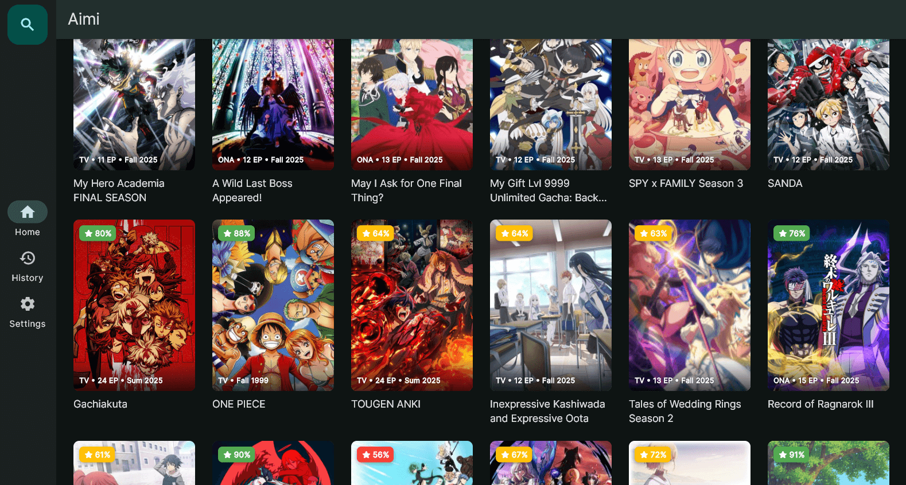
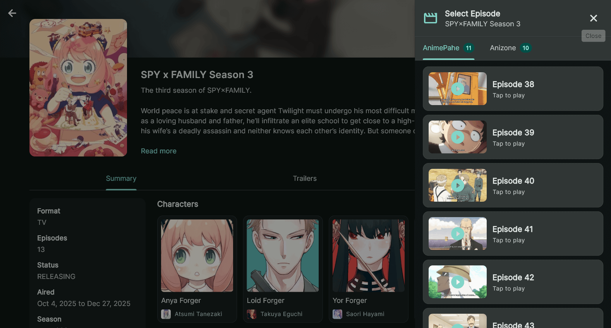
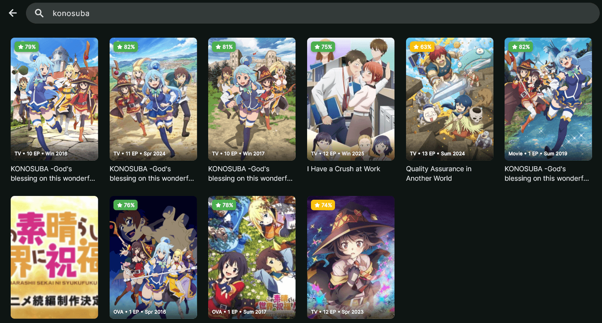

# Aimi

A modern, cross-platform anime streaming app built with Flutter.

|    |  |
|:---------------------------------:|:---------------------------------:|
|  |  |

## ✨ Features

- **Multi-Source Streaming** — Aggregates streams from various providers into a unified interface
- **Rich Metadata** — Anime details, trending lists, and search powered by AniList
- **Cross-Platform** — Android, Windows, and Linux support
- **High-Performance Player** — Hardware-accelerated playback via `media_kit`
- **Watch History** — Automatically tracks progress and resumes playback
- **Modular Design** — Easily extensible for new providers

## 📦 Downloads

Get the latest release: **[Releases Page](https://github.com/brokiem/aimi/releases)**

> For installation instructions and platform-specific tips, see [docs/RELEASES.md](docs/RELEASES.md)

## 🏗️ Architecture

| Package | Description |
|:--------|:------------|
| [`aimi_app`](packages/aimi_app) | Flutter app — UI, state management, platform integrations |
| [`aimi_lib`](packages/aimi_lib) | Core Dart library — providers, models, business logic |

## 🔌 Providers

| Type | Provider | Status |
|:-----|:---------|:-------|
| Metadata | AniList | ✅ Active |
| Streaming | AnimePahe | ✅ Active |
| Streaming | Anizone | ✅ Active |

## 🚀 Development

```bash
git clone https://github.com/brokiem/aimi.git
cd aimi/packages/aimi_app
flutter pub get
flutter run
```

> Full setup guide: [docs/INSTALLATION.md](docs/INSTALLATION.md)

## 🤝 Contributing

Contributions welcome! See [docs/CONTRIBUTING.md](docs/CONTRIBUTING.md) for guidelines.

## 📄 License

[GNU GPL v2.0](LICENSE)
